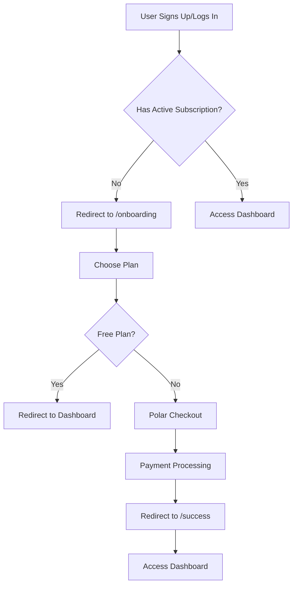

# Polar Checkout Integration with Better Auth

This project integrates Polar's subscription billing with Better Auth to provide a seamless onboarding and checkout experience.

## Overview

The integration includes:
- **Onboarding Page**: `/onboarding` - Displays subscription plans and handles checkout
- **Success Page**: `/success` - Confirms successful subscription activation
- **Subscription Management**: Customer portal access for managing subscriptions
- **Middleware Protection**: Automatically redirects users without active subscriptions to onboarding

## How It Works

### 1. Authentication & Onboarding Flow



### 2. Polar Configuration

The Polar integration is configured in `src/lib/auth.ts`:

```typescript
polar({
  client: polarClient,
  createCustomerOnSignUp: true,
  use: [
    checkout({
      products: [
        { productId: env.FREE_PRODUCT_ID, slug: "Free" },
        { productId: env.PRO_PRODUCT_ID, slug: "Pro" }
      ],
      successUrl: `${env.NEXT_PUBLIC_APP_URL}/success?checkout_id={CHECKOUT_ID}`,
      authenticatedUsersOnly: true,
    }),
    portal(),
    usage()
  ],
})
```

### 3. Checkout Process

#### Initiating Checkout

```typescript
// For Pro plan
await authClient.checkout({
  slug: "Pro"  // Uses the slug defined in auth config
});

// Alternative: Using product ID directly
await authClient.checkout({
  products: ["your-polar-product-id"]
});
```

#### With Organization Reference

```typescript
await authClient.checkout({
  slug: "Pro",
  referenceId: organizationId  // Links subscription to organization
});
```

### 4. Customer State Management

Check subscription status:

```typescript
const { data: customerState } = await authClient.customer.state();

// Check active subscriptions
const hasActiveSubscription = customerState?.activeSubscriptions?.length > 0;

// Access subscription details
const subscription = customerState?.activeSubscriptions?.[0];
```

### 5. Customer Portal

Allow users to manage their subscriptions:

```typescript
// Redirects to Polar's customer portal
await authClient.customer.portal();
```

## Environment Variables

Required environment variables:

```env
# Polar Configuration
POLAR_ACCESS_TOKEN=your_polar_access_token
FREE_PRODUCT_ID=your_free_product_id
PRO_PRODUCT_ID=your_pro_product_id

# Better Auth
BETTER_AUTH_SECRET=your_secret
BETTER_AUTH_URL=http://localhost:3000

# App Configuration
NEXT_PUBLIC_APP_URL=http://localhost:3000
```

## Key Components

### Onboarding Page (`/onboarding`)
- Displays Free and Pro plan options
- Handles plan selection and checkout initiation
- Responsive design with feature comparisons

### Success Page (`/success`)
- Confirms successful subscription activation
- Displays subscription details
- Provides next steps for users

### Subscription Status Component
- Shows current subscription status
- Provides upgrade/manage subscription buttons
- Displays usage information

### Middleware Protection
- Automatically redirects users without subscriptions to onboarding
- Excludes auth and onboarding routes from redirection
- Handles errors gracefully

## Usage Examples

### Basic Checkout Flow

```typescript
// 1. User selects Pro plan on onboarding page
const handlePlanSelection = async (planSlug: string) => {
  if (planSlug === "Free") {
    router.push("/dashboard");
    return;
  }
  
  // Initiate Polar checkout for paid plans
  await authClient.checkout({ slug: planSlug });
};
```

### Checking Subscription Status

```typescript
// In any component
const [customerState, setCustomerState] = useState(null);

useEffect(() => {
  const fetchCustomerState = async () => {
    const { data } = await authClient.customer.state();
    setCustomerState(data);
  };
  fetchCustomerState();
}, []);

const hasProAccess = customerState?.activeSubscriptions?.some(
  sub => sub.product?.name === "Pro"
);
```

### Managing Subscriptions

```typescript
// Open customer portal
const handleManageSubscription = async () => {
  await authClient.customer.portal();
};
```

## Webhook Handling (Optional)

For advanced use cases, you can handle Polar webhooks:

```typescript
// In auth configuration
webhooks({
  secret: process.env.POLAR_WEBHOOK_SECRET,
  onOrderPaid: (payload) => {
    // Handle successful payment
    console.log("Order paid:", payload);
  },
  onCustomerStateChanged: (payload) => {
    // Handle customer state changes
    console.log("Customer state changed:", payload);
  }
})
```

## Testing

### Sandbox Environment

For development, use Polar's sandbox environment:

```typescript
const polarClient = new Polar({
  accessToken: env.POLAR_ACCESS_TOKEN,
  server: process.env.NODE_ENV === "production" ? "production" : "sandbox",
});
```

### Test Cards

Use Polar's test payment methods in sandbox mode to test the checkout flow.

## Troubleshooting

### Common Issues

1. **Middleware Redirect Loop**: Ensure onboarding routes are excluded from subscription checks
2. **Checkout Not Working**: Verify product IDs and slugs match Polar dashboard
3. **Customer State Not Loading**: Check Polar access token and API permissions

### Debug Tips

- Check browser network tab for API calls
- Verify environment variables are loaded correctly
- Use Polar dashboard to monitor checkout sessions
- Check server logs for webhook events

## Security Considerations

- Never expose Polar access tokens in client-side code
- Use webhook secrets to verify webhook authenticity
- Implement proper error handling for failed payments
- Validate subscription status server-side for sensitive operations 